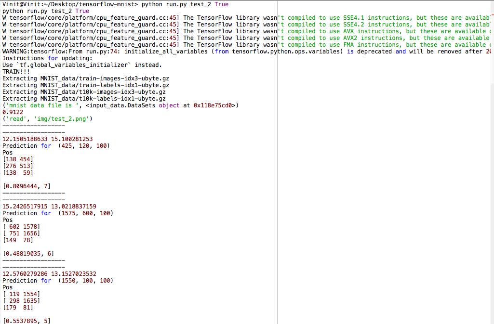

# Detecting Hand Written Digits
With the help of <a href="https://www.tensorflow.org">Tensorflow</a>
and <a href="http://yann.lecun.com/exdb/mnist/">MNIST Dataset</a>
hand written digits can be identified with an accuracy of >90%.

### Installation :
- tensorflow
- opencv,cv2
- numpy
- scipy
- urllib

It will be awesome if you run this code in <a href="https://www.continuum.io/downloads">Anaconda</a>(the world’s most popular and trusted data science ecosystem) as most of the libraries are already installed which saves your hell lot of time.

### Run
Open terminal and type:
- git clone https://github.com/bodhwani/Detect-HandWrittenDigits.git
- cd Detect-HandWrittenDigits
- Create a empty folder MNIST_data
> If want to train model(running for the first time):
- python run.py test_2(name of the image in img folder) True
> Else:
- python run.py test_2

### Result :

**Input**
 
**Output** 

And you are ready to go. Kudos!!

